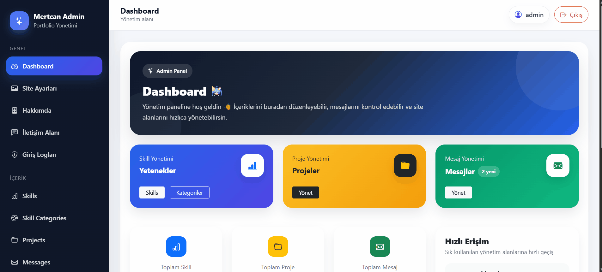
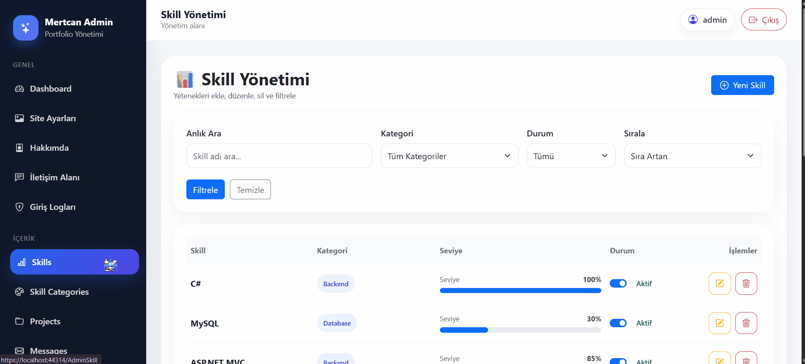
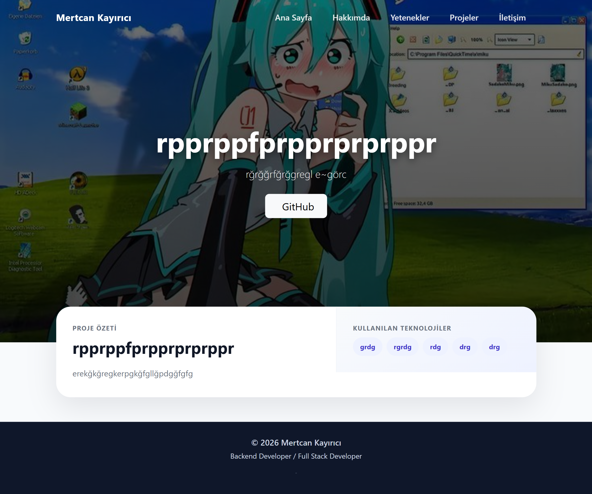
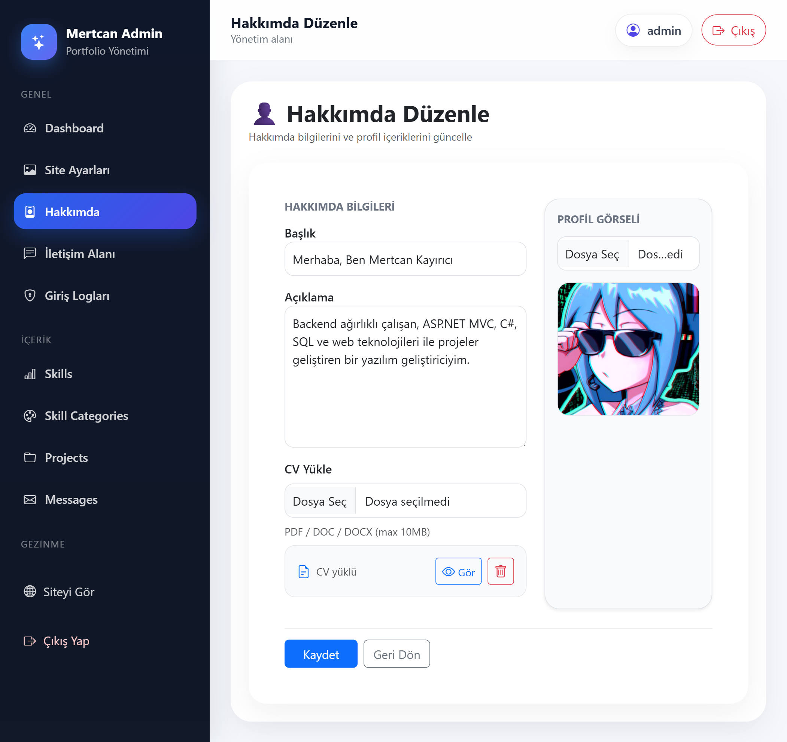
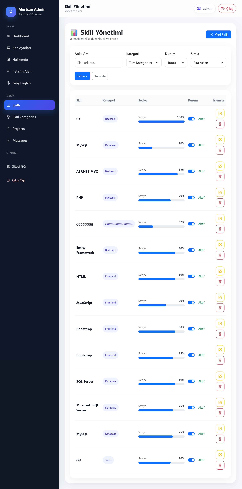
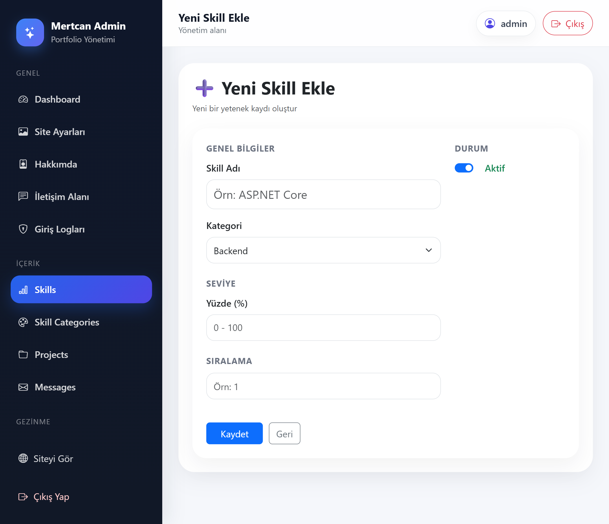
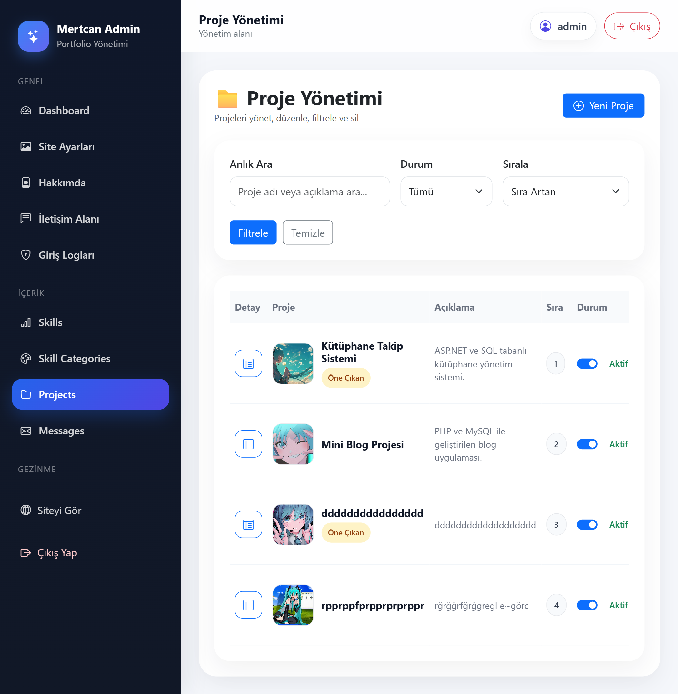
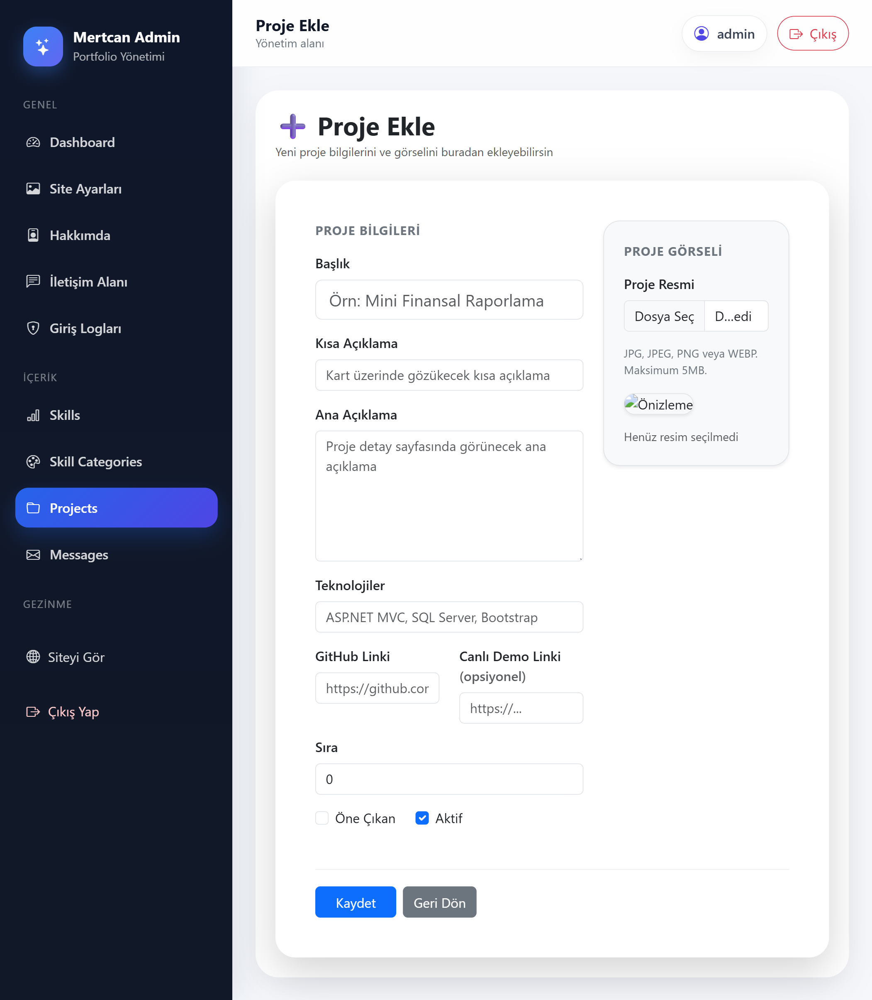
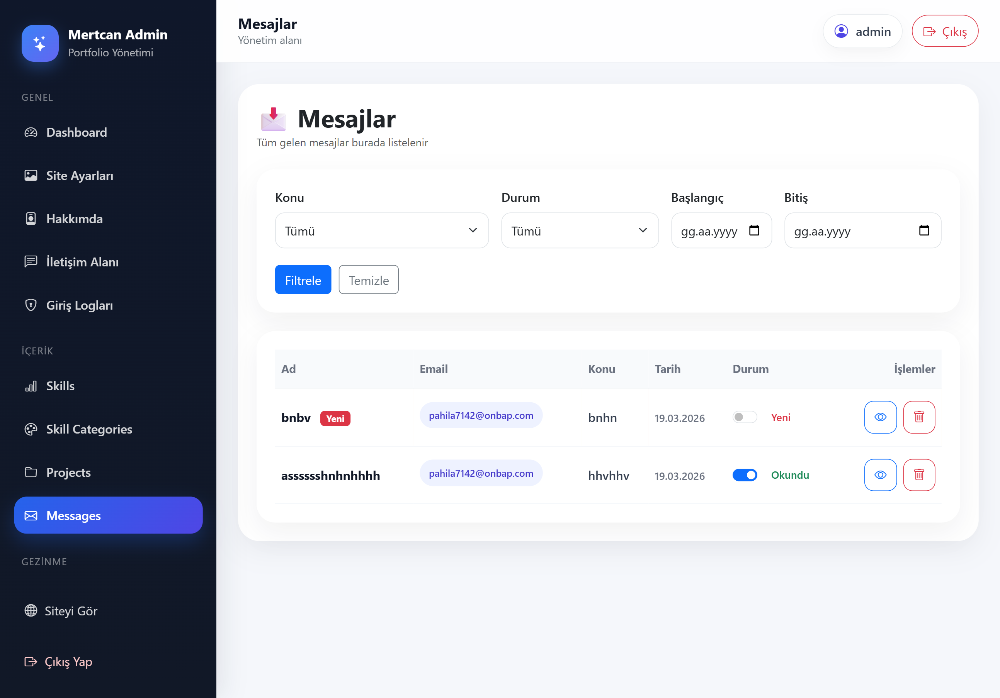

# 🚀 Portfolio Management System

A modern and fully dynamic **portfolio management system** built with **ASP.NET MVC, Entity Framework, and SQL Server**.

This project includes a **powerful admin panel** that allows full control over portfolio content such as projects, skills, messages, and site settings.

---

## 🎬 Demo

> Admin panel and portfolio system in action


---

## ✨ Key Features

- 🔐 Authentication-based Admin Panel  
- 📂 Full CRUD Operations (Projects, Skills, Messages, etc.)  
- 🧩 Dynamic Project Detail Sections  
- ⚡ Real-time Preview System (Admin Panel)  
- 📊 Relational Database Design (SQL Server)  
- 🎨 Responsive UI (Bootstrap 5)  
- 💬 Contact & Message Management  
- 📈 Login Activity Logging System  

---

## 🛠️ Tech Stack

- ASP.NET MVC (.NET Framework)  
- Entity Framework  
- Microsoft SQL Server  
- Bootstrap 5  
- JavaScript (AJAX, DOM Manipulation)  
- HTML5 / CSS3  

---

## 🎥 Feature Demonstrations

### 🔐 Authentication System


### ⚙️ Admin Dashboard & Management


### ✏️ Content Management & Live Preview


---

## 📸 Screenshots

### 🌐 Public Interface

#### 🏠 Homepage


#### 🔍 Project Detail (Empty State)


#### 🔍 Project Detail (Full View)


---

### ⚙️ Admin Panel

#### 📊 Dashboard


#### 🖼️ Site Settings


#### 👤 About Section


#### ⚡ Real-time Preview System


#### 🧠 Skills Management


#### ➕ Add Skill


#### ✏️ Edit Skill


#### 🎨 Skill Categories


#### 📂 Projects Management


#### ➕ Add Project


#### ✏️ Edit Project


#### 🧩 Project Sections


#### 💬 Messages


#### 🔐 Login Logs


#### 🔑 Login Page


---

## 🧠 Database Design


---

## ⚡ Highlight Feature

One of the standout features of this project is the **real-time preview system** in the admin panel.

While editing content such as contact information or project details, users can instantly preview changes before saving them.  
This improves user experience and reduces potential errors.

---

## ⚙️ Installation

### 1. Clone the repository
```bash
git clone https://github.com/MertcanKayirici/PortfolioManagementSystem.git
```

### 2. Open the project
Open the solution file (`.sln`) with Visual Studio.

### 3. Configure database connection
Update your connection string in **Web.config**:

⚠️ Replace `YOUR_SERVER_NAME` with your local SQL Server instance.

```xml
<connectionStrings>
  <add name="PortfolioDbEntities"
       connectionString="Data Source=YOUR_SERVER_NAME;Initial Catalog=PortfolioDb;Integrated Security=True"
       providerName="System.Data.SqlClient" />
</connectionStrings>
```

### 4. Create the database
Run the SQL script located in the `Database` folder.

### 5. Run the project
Press `F5` or click **Start** in Visual Studio.

---

## 📌 Important Notes

- Ensure SQL Server is running  
- Update connection string before running  
- Do not share sensitive credentials  

---

## 📂 Project Structure

- Controllers → MVC Controllers  
- Models → Entity Framework Models  
- Views → Razor Views  
- Content → CSS, images, static files  
- Scripts → JavaScript files  

---

## 👨‍💻 Developer

**Mertcan Kayırıcı**

- Backend-focused Full Stack Developer  
- ASP.NET MVC & SQL Server  

---

## ⭐ Project Purpose

This project was developed to simulate a **real-world portfolio management system**, focusing on clean architecture, dynamic content handling, and a modern admin experience.