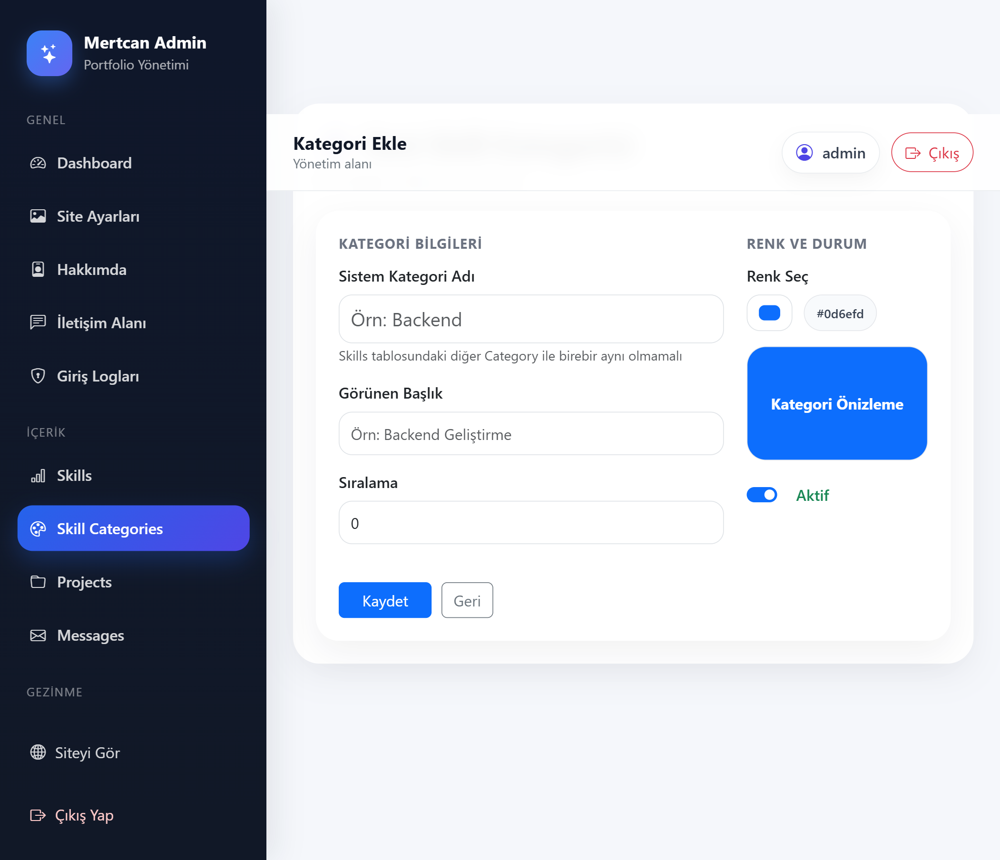
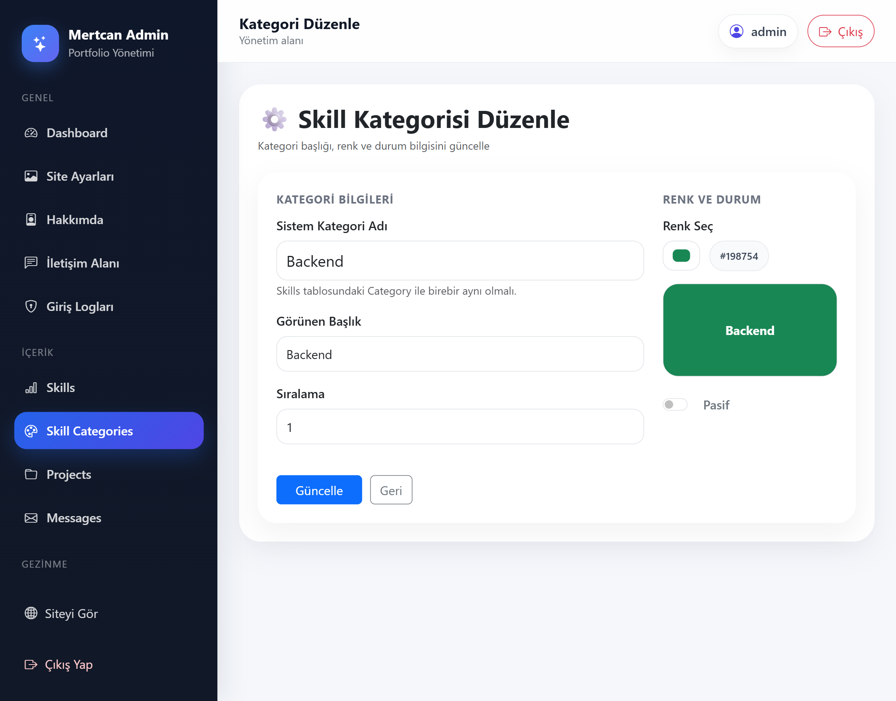
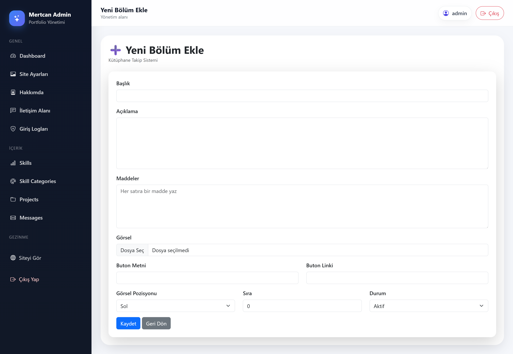
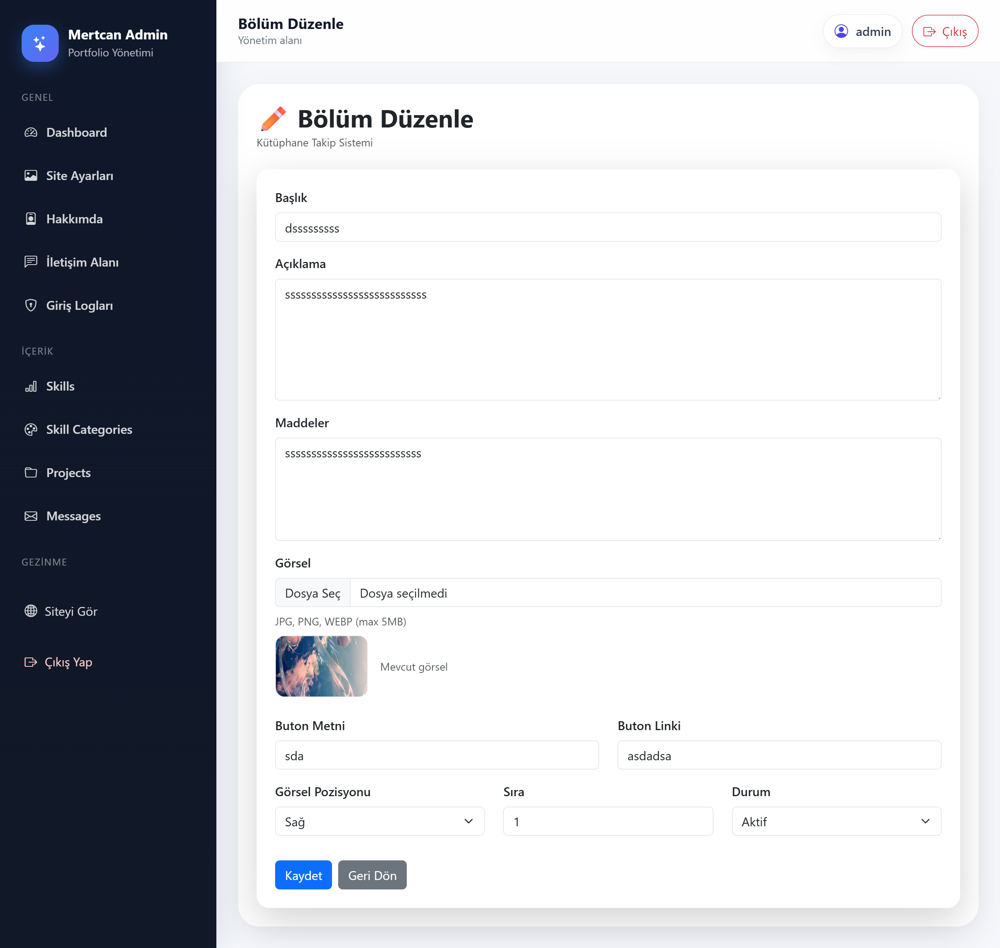

# 🚀 Portfolio Management System

A modern and fully dynamic **portfolio management system** built with **ASP.NET MVC, Entity Framework, and SQL Server**.

This project provides a complete solution for managing portfolio content through a powerful **admin panel**, while delivering a clean and responsive **public-facing website**.

---

### 🎬 Demo GIFs

| 🔐 Login Flow |
|------------|
| |

| 🖥️ General Pages | 📦 Content Pages |
|------------|-------------|
|  |  |

---

## ✨ Features

### 🔐 Authentication & Security
- Secure login system  
- Password hashing (PBKDF2 - salted)  
- Login activity logging (IP + timestamp)  

### 📊 Admin Panel
- Full CRUD operations (Projects, Skills, Messages, etc.)  
- Dynamic dashboard overview  
- Real-time preview system  
- Site settings management  

### 🌐 Portfolio Website
- Dynamic project rendering  
- Responsive UI (Bootstrap 5)  
- Contact & message system  
- Clean and modern design  

---

## 🛠️ Tech Stack

- ASP.NET MVC (.NET Framework)  
- Entity Framework  
- Microsoft SQL Server  
- Bootstrap 5  
- JavaScript (AJAX, DOM Manipulation)  
- HTML5 / CSS3  

---

## 📸 Screenshots

### 🌐 Homepage


---

### 📊 Dashboard & Settings

| Dashboard | Site Settings |
|----------|--------------|
|  |  |

---

### 👤 About & Live Preview

| About Edit | Live Preview |
|-----------|-------------|
|  |  |

---

### 🛠️ Skills Management

| Skill List | Add Skill | Edit Skill |
|-----------|-----------|------------|
|  |  |  |

---

### 🗂️ Skill Categories

| List | Add | Edit |
|------|-----|------|
|  |  |  |

---

### 📁 Projects Management

| Project List | Add Project | Edit Project |
|--------------|------------|--------------|
|  |  |  |

---

### 🧩 Project Sections

| Section List | Add Section | Edit Section |
|--------------|------------|--------------|
|  |  |  |

---

### 💬 Messages & Logs

| Messages | Login Logs |
|----------|------------|
|  |  |

---

### 🔐 Authentication

| Login |
|------|
|  |

---

### 🌐 Project Detail Page

| Empty | Full |
|------|------|
|  |  |

---

### 🧠 Database Diagram


---

## 🚀 Key Highlights

- Real-time preview system in admin panel  
- Fully dynamic content management  
- Secure authentication with logging system  
- Clean and scalable database design  

---

## 🏗️ Architecture

This project follows a **layered MVC architecture**:

- Controllers → Handle HTTP requests and application flow  
- Models → Represent database entities (Entity Framework)  
- Views → Razor-based UI rendering  
- Database → SQL Server relational structure  

The system is designed with **separation of concerns** and maintainability in mind.

---

## 🔄 How It Works

### 🌐 User Side
1. User visits the portfolio website  
2. Data is fetched from SQL Server via Entity Framework  
3. Controllers process the request  
4. Views render dynamic content  

### 🔐 Admin Panel
1. Admin logs in securely  
2. Performs CRUD operations  
3. Changes are instantly reflected on the website  

---

## ⚙️ Installation

### 1. Clone the repository
```bash
git clone https://github.com/MertcanKayirici/PortfolioManagementSystem.git
```
### 2. Open the project

Open the .sln file using Visual Studio

### 3. Create database

Create a database named:
```bash
PortfolioDb
```
### 4. Run SQL script

Execute:
```bash
Database/PortfolioDb.sql
```
### 5. Configure connection string

Update your `Web.config`:

```xml
<connectionStrings>
  <add name="PortfolioDb"
       connectionString="Data Source=YOUR_SERVER_NAME;Initial Catalog=PortfolioDb;Integrated Security=True"
       providerName="System.Data.SqlClient" />
</connectionStrings>
```
- ⚠️ Make sure to replace YOUR_SERVER_NAME with your SQL Server instance name.

## 6. Run the project

Run the project using **Visual Studio (F5)** 🚀

---

## 📌 Important Notes
- Ensure SQL Server is running
- Update the connection string before running
- Do not share sensitive credentials

---

## 📂 Project Structure
- Controllers   → MVC Controllers  
- Models        → Entity Framework Models  
- Views         → Razor Views  
- Database      → SQL Scripts  
- Screenshots   → Images & GIF files  

---

## 👨‍💻 Developer

Mertcan Kayırıcı

Backend-focused Full Stack Developer
ASP.NET MVC & SQL Server

---

## ⭐ Project Purpose

This project was developed to simulate a real-world portfolio management system, focusing on:

Clean architecture principles
Dynamic content management
Admin panel usability
Scalable database design
