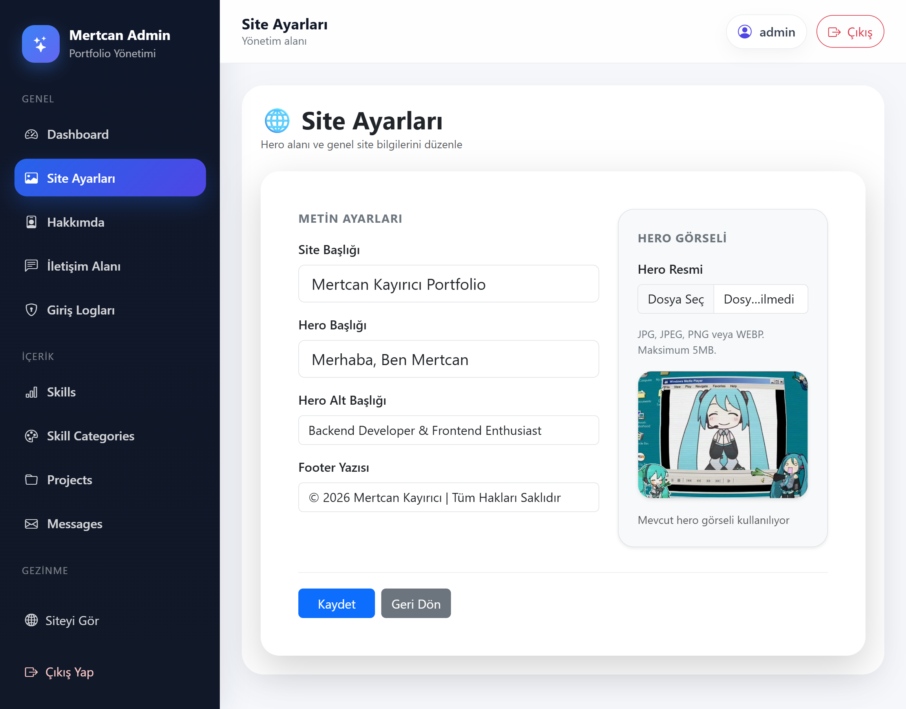
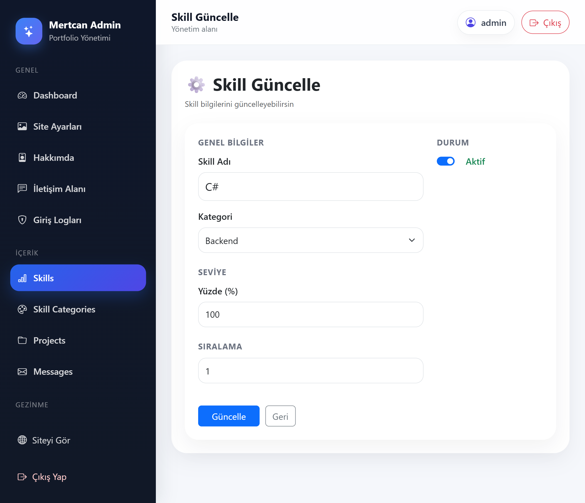
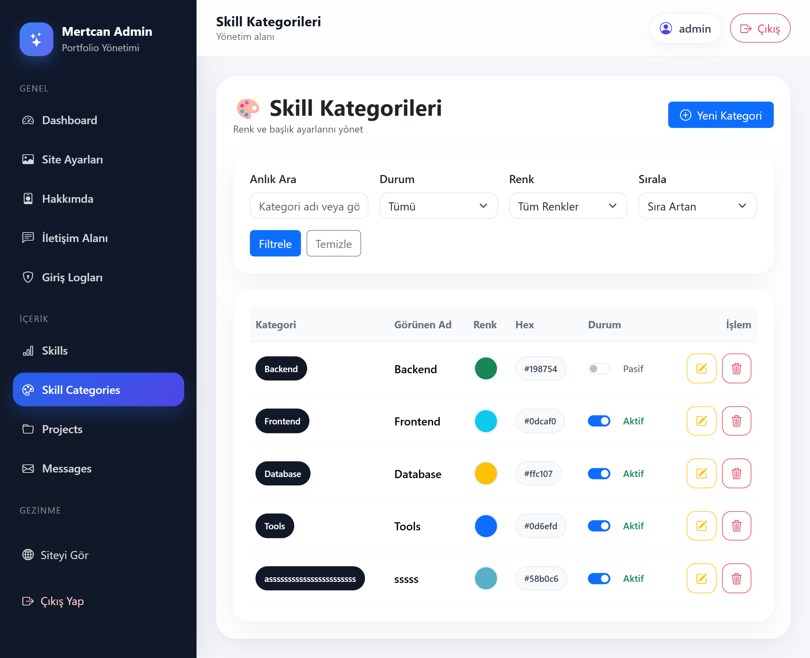
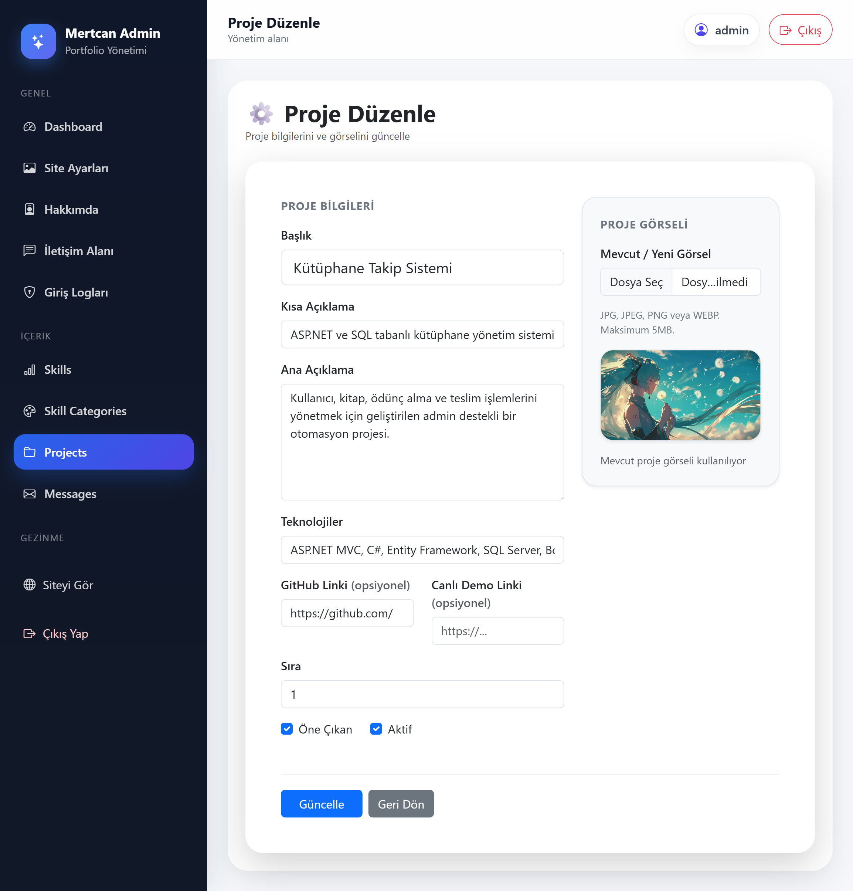
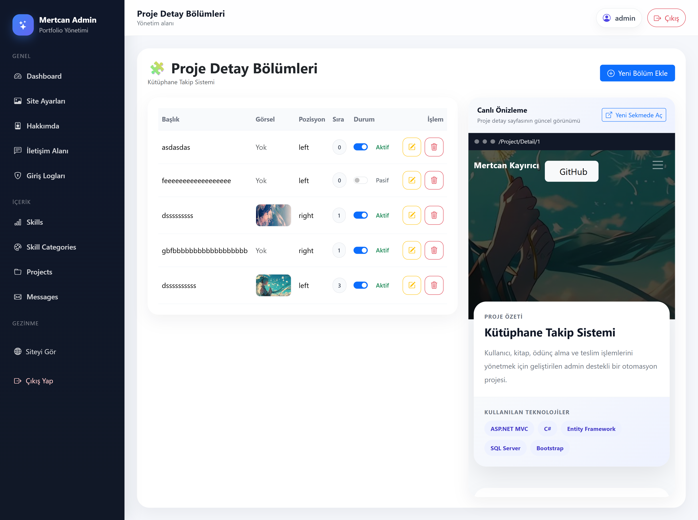
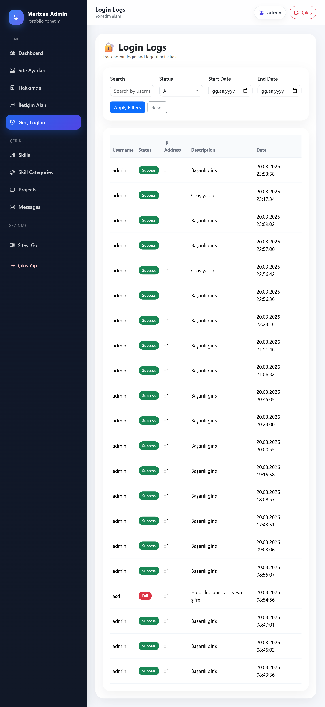
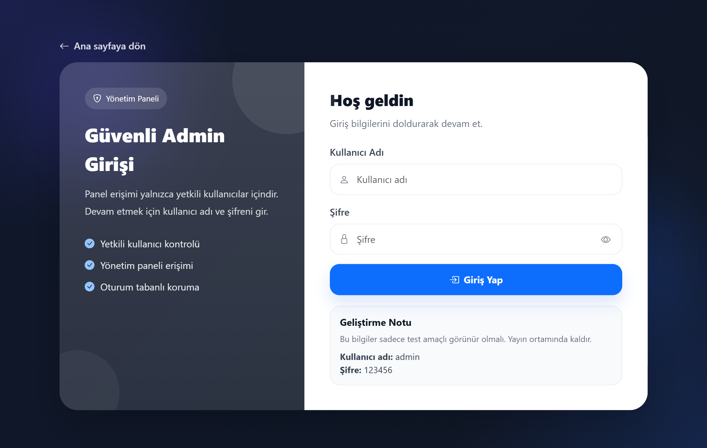

# 🚀 Portfolio Management System

A modern **portfolio website with a powerful admin panel** built using **ASP.NET MVC, Entity Framework and SQL Server**.

This project allows full control over portfolio content such as projects, skills, contact information and more through a dynamic admin panel.

---

## ✨ Features

* 🔐 Secure Admin Authentication System
* 📂 Full CRUD operations (Projects, Skills, Messages, etc.)
* 🧩 Dynamic Project Detail Sections
* ⚡ Real-time Preview System (Admin Panel)
* 📊 Structured Database Design (Relational)
* 🎨 Responsive UI with Bootstrap 5
* 📝 Contact form & message management
* 📈 Login logging system

---

## 🛠️ Technologies Used

* ASP.NET MVC (.NET Framework)
* Entity Framework
* Microsoft SQL Server
* Bootstrap 5
* JavaScript / AJAX
* HTML5 / CSS3

---

## 📸 Screenshots

### 🌐 Public Pages

#### 🏠 Homepage


#### 🔍 Project Detail (Empty)


#### 🔍 Project Detail (Full)


---

### ⚙️ Admin Panel

#### 📊 Dashboard


#### 🖼️ Site Settings



#### 👤 About Section


#### ⚡ Live Preview System


#### 🧠 Skills Management


#### ➕ Skill Add


#### ✏️ Skill Edit



#### 🎨 Skill Categories



#### 📂 Projects


#### ➕ Project Add


#### ✏️ Project Edit



#### 🧩 Project Sections



#### 💬 Messages


#### 🔐 Login Logs



#### 🔑 Login Page



---

## 🧠 Database Design


---

## ⚡ Highlight Feature

One of the most important features of this project is the **real-time preview system in the admin panel**.

While editing content (such as contact section or project details), changes can be previewed instantly before saving.

This improves user experience and prevents incorrect data entry.

---

## ⚙️ Installation

1. Clone the repository

```bash
git clone https://github.com/your-username/your-repo-name.git
```

2. Open the project in **Visual Studio**

3. Configure your database connection in `Web.config`

```xml
data source=YOUR_SERVER_NAME;
initial catalog=PortfolioDb;
integrated security=True;
```

4. Run the SQL script to create the database

5. Start the project

---

## 📌 Notes

* Make sure SQL Server is running
* Update connection string before running
* Do not commit sensitive data

---

## 👨‍💻 Developer

**Mertcan Kayırıcı**

* Backend-focused Full Stack Developer
* ASP.NET MVC & SQL Server specialist

---

## ⭐ Final Note

This project was developed to demonstrate real-world portfolio management systems with a clean architecture and modern admin experience.
