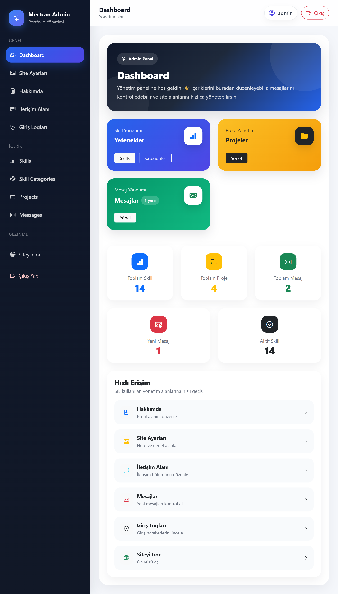
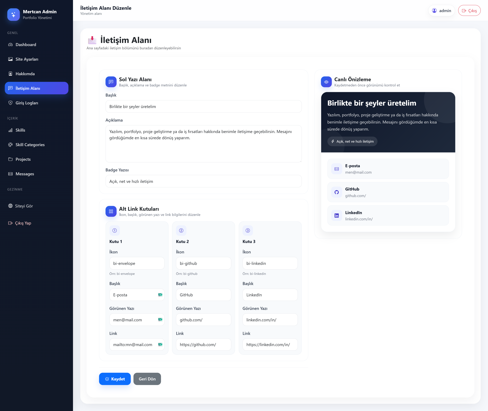
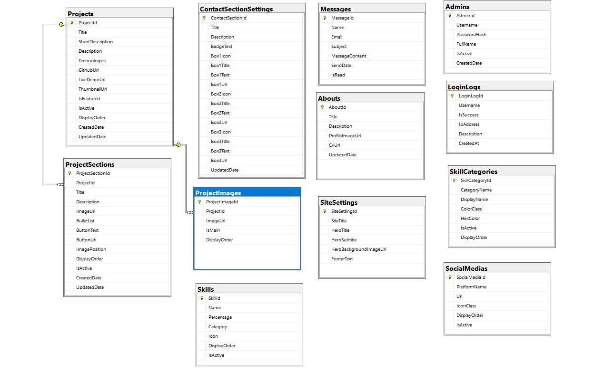

# 🚀 Portfolio Management System

A modern and fully dynamic **portfolio management system** built with **ASP.NET MVC, Entity Framework, and SQL Server**.

This project provides a **powerful admin panel** to manage all portfolio content including projects, skills, contact information, and more.

---

## ✨ Key Features

* 🔐 Authentication-based Admin Panel
* 📂 Full CRUD Operations (Projects, Skills, Messages, etc.)
* 🧩 Dynamic Project Detail Sections
* ⚡ Real-time Preview System (Admin Panel)
* 📊 Relational Database Design (SQL Server)
* 🎨 Responsive UI (Bootstrap 5)
* 💬 Contact & Message Management
* 📈 Login Activity Logging System

---

## 🛠️ Tech Stack

* ASP.NET MVC (.NET Framework)
* Entity Framework
* Microsoft SQL Server
* Bootstrap 5
* JavaScript (AJAX)
* HTML5 / CSS3

---

## 📸 Screenshots

### 🌐 Public Interface

#### 🏠 Homepage


#### 🔍 Project Detail (Empty State)


#### 🔍 Project Detail (Full View)


---

### ⚙️ Admin Panel

#### 📊 Dashboard



#### 🖼️ Site Settings


#### 👤 About Section


#### ⚡ Real-time Preview System



#### 🧠 Skills Management


#### ➕ Add Skill


#### ✏️ Edit Skill


#### 🎨 Skill Categories


#### 📂 Projects Management


#### ➕ Add Project


#### ✏️ Edit Project


#### 🧩 Project Sections


#### 💬 Messages


#### 🔐 Login Logs


#### 🔑 Login Page


---

## 🧠 Database Design



---

## ⚡ Highlight Feature

One of the standout features of this project is the **real-time preview system** in the admin panel.

While editing content such as contact information or project details, users can instantly preview changes before saving them.
This significantly improves user experience and reduces potential errors.

---

## ⚙️ Installation

### 1. Clone the repository
```bash
git clone https://github.com/MertcanKayirici/PortfolioManagementSystem.git
```

### 2. Open the project
Open the solution file (`.sln`) with Visual Studio.

### 3. Configure database connection
Update your connection string in **Web.config**:

```xml
<connectionStrings>
  <add name="PortfolioDbEntities"
       connectionString="Data Source=YOUR_SERVER_NAME;Initial Catalog=PortfolioDb;Integrated Security=True"
       providerName="System.Data.SqlClient" />
</connectionStrings>
```

### 4. Create the database
Run the SQL script located in the project to create the database.

### 5. Run the project
Press `F5` or click **Start** in Visual Studio.

---

## 📌 Important Notes

* Ensure SQL Server is running
* Update connection string before running
* Do not share sensitive credentials

---

## 👨‍💻 Developer

**Mertcan Kayırıcı**

* Backend-focused Full Stack Developer
* ASP.NET MVC & SQL Server

---

## ⭐ Project Purpose

This project was developed to simulate a **real-world portfolio management system**, focusing on clean architecture, dynamic content handling, and modern admin experience.
